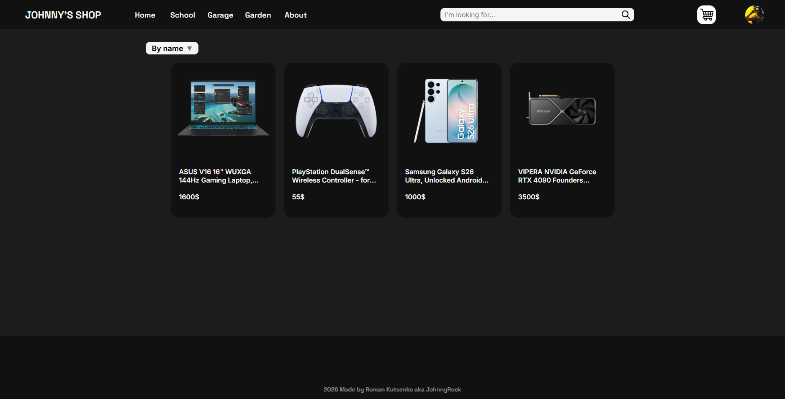
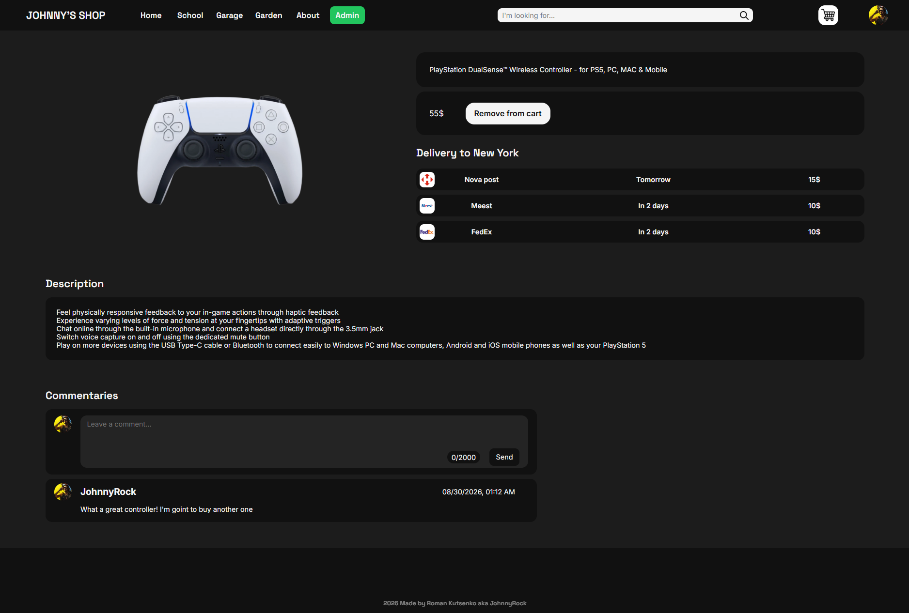
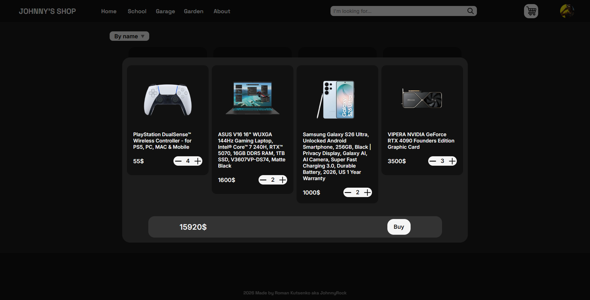
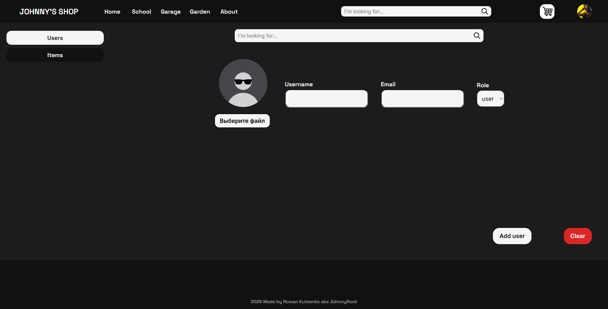
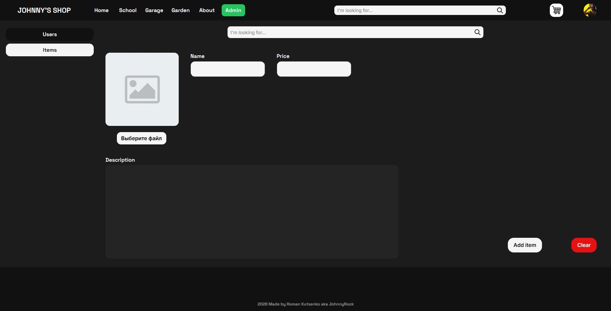

# 🛒 Online Store

An online store with a product catalog, shopping cart, and order checkout. A fullstack pet project built with React (client) and Node.js/Express (server).

> ⚠️ This project is under active development (alpha). Some pages and error handling are not fully implemented yet — see [Known Limitations](#-known-limitations) below.

## 📸 Demo








## ✨ Features

- [x] Product catalog with sorting
- [x] Product detail page
- [x] Shopping cart
- [x] User registration and authentication
- [ ] Order checkout
- [ ] Order history
- [x] Admin panel for product management

## 🚧 Known Limitations

- Error handling is not implemented on all API endpoints yet
- Some pages are still under construction
- Not deployed yet — currently runs locally only

## 🛠 Tech Stack

**Frontend** (`client/`)
- React
- React Router
- Context API (`src/Context`, `src/Provider`)
- Custom hooks (`src/Hooks`)
- Axios
- CSS Modules

**Backend** (`server/`)
- Node.js
- Express
- PostgreSQL
- File uploads (`server/uploads`)
- JWT for authentication

**Tools**
- Git / GitHub
- Docker

## 📁 Project Structure

```
online-store/
├── client/                  # Frontend (React)
│   ├── public/
│   ├── src/
│   │   ├── API/             # Backend API calls
│   │   ├── Context/         # React Context providers
│   │   ├── Hooks/           # Custom hooks
│   │   ├── Pages/           # Application pages
│   │   ├── Provider/        # Context/state providers
│   │   ├── Styles/          # Global styles
│   │   ├── UI/              # UI components
│   │   ├── App.jsx
│   │   └── index.js
│   └── package.json
├── server/                  # Backend (Node.js/Express)
│   ├── src/
│   │   ├── controllers/     # Request handling logic
│   │   ├── db/               # Database connection/config
│   │   ├── routes/          # API routes
│   │   └── uploads/
│   ├── uploads/              # Uploaded files (images, etc.)
│   ├── .env                  # Environment variables (not committed)
│   └── app.js
└── README.md
```

## 🚀 Getting Started

### Prerequisites
- Node.js 18+
- npm
- PostgreSQL

### 1. Clone the repository

```bash
git clone https://github.com/your-username/online-store.git
cd online-store
```

### 2. Install dependencies

```bash
# Backend
cd server
npm install

# Frontend
cd ../client
npm install
```

### 3. Set up environment variables

Create a `.env` file in the `server` folder based on `.env.example`:

```env
PORT=5000
DATABASE_URL=your_database_connection_string
JWT_SECRET=your_secret_key
```

### 4. Run the project

```bash
# Backend (from the server folder)
npm start

# Frontend (from the client folder, in a separate terminal)
npm start
```

The app will be available at `http://localhost:3000`, the API at `http://localhost:5000/api`.

## 📡 API Endpoints

All backend routes are prefixed with `/api` to distinguish them from frontend routes.

| Method | Endpoint              | Description                     |
|--------|-----------------------|---------------------------------|
| GET    | `/api/products`       | Get list of products            |
| GET    | `/api/products/:id`   | Get a single product            |
| POST   | `/api/auth/signup`    | Register a new user             |
| POST   | `/api/auth/login`     | Log in                          |
| GET    | `/api/cart`           | Get current user's cart         |
| POST   | `/api/cart`           | Add item to cart                |
| PATCH  | `/api/cart/:id`       | Update item quantity in cart    |
| DELETE | `/api/cart/:id`       | Remove item from cart           |
| GET    | `/api/comments/:id`   | Get reviews for a product       |
| POST   | `/api/comments/:id`   | Leave a review about a product  |
| DELETE | `/api/comments/:id`   | Delete a review about a product |
| POST   | `/api/orders`         | Place an order                  |


## 🗺 Roadmap

- [ ] Implement order checkout and payment
- [ ] Add error handling across all endpoints
- [x] Add admin panel
- [ ] Write unit tests for the backend
- [ ] Deploy to Vercel/Render
- [x] Optimize content loading

## 🤝 Feedback

This is a learning project, but suggestions and feedback are welcome. If you find a bug or have an idea, feel free to open an Issue.

## 📄 License

MIT
